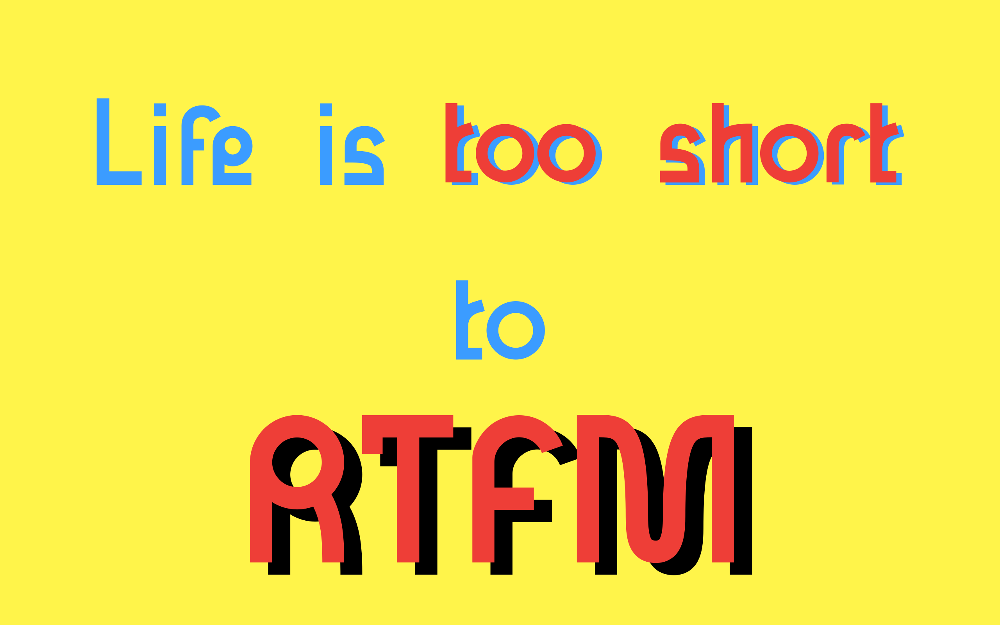

# Yet Another CTF Playbook

## What?

The goal of this manual is to gather common attack and recon techniques
harvested by CTF experience, write-ups and other books.

On the contrary of the usual listing of common commands, it tries to build
workflows.

It bases itself on a three-part methodology:

* Enumerate
* Exploit
* Post-Exploit

Please consider this work as a work-in-progress. I am no expert and no
professional.

## Why?

The Internet is full of documented exploits and documented common cheatsheets
for basic CTFs. However, I felt like it missed the process and methodology part.  Hopefully this work will answer this.

## How?

The whole project is written with Markdown and you can read the project as such
or get the online version (soon).

You can build a PDF as well for a more comfortable read. You will need [pandoc]() and [eisvogel](https://github.com/Wandmalfarbe/pandoc-latex-template). You can run the `manual.sh` script to build the PDF.

## Whom?

This manual is written for people already comfortable with the command line and
common tools on Kali Linux or Parrot. If you just started doing CTF (especially
Hack The Box ones), you might use this work as a base for your learning.

Feel free to open issues in case you have any inquiry!

## I want more! (and I like using the terminal!)

In parallel of this manual, you can use Tek's [tips](https://github.com/christalib/tips?organization=christalib&organization=christalib) small program which displays handy tips about a lot of commands! You can find my fork of those commands [here](https://github.com/christalib/commands-for-sec).
